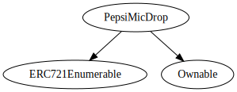
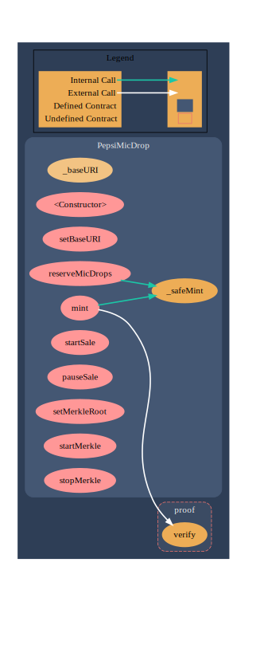

# Pepsi NFT Contract Examination

* SPDX License Identifier is the first line after comment. It indicates how other people can use this [code](https://github.com/ErdemOzgen/Solidity-Learning-Archive/blob/03ebac2dd7d04cc1d87e78aae1869b0eb60d3209/BooksAndCodes/NFTContractExamples/PepsiNFTExamination.sol#L36).

* Solidity Version lets the compiler translate the code correctly, and then the EVM can understand. [Code](https://github.com/ErdemOzgen/Solidity-Learning-Archive/blob/03ebac2dd7d04cc1d87e78aae1869b0eb60d3209/BooksAndCodes/NFTContractExamples/PepsiNFTExamination.sol#L37)

* Import ERC-721 contracts then the Pepsi NFT contract will use the ERC-721 contract as its blueprint. [Code](https://github.com/ErdemOzgen/Solidity-Learning-Archive/blob/03ebac2dd7d04cc1d87e78aae1869b0eb60d3209/BooksAndCodes/NFTContractExamples/PepsiNFTExamination.sol#L39)

* 

 

* PepsiMicDrop is the NFT contract we will further discuss in the next section. It has three subparts: (1)State Variables (2)Constructor (3)Functions.

* State variables are variables whose values are permanently stored in contract storage.

* Constructor is a special function that is only executed upon contract creation. You can run the contract initialization code.

* Functions are self-explanatory. Most functions are used to set or get state values.

* (1) Constructor [Code](https://github.com/ErdemOzgen/Solidity-Learning-Archive/blob/03ebac2dd7d04cc1d87e78aae1869b0eb60d3209/BooksAndCodes/NFTContractExamples/PepsiNFTExamination.sol#L64)
```solidity
constructor() ERC721("Pepsi Mic Drop", "PEPSIMICDROP") {
    reserveMicDropsId = 1; // item 1-50
    micDropsId = 51; // item 51-1893
}
```

The constructor takes 2 inputs:

1. “Pepsi Mic Drop” is the NFT token name
2. “PEPSIMICDROP” is the token symbol.

